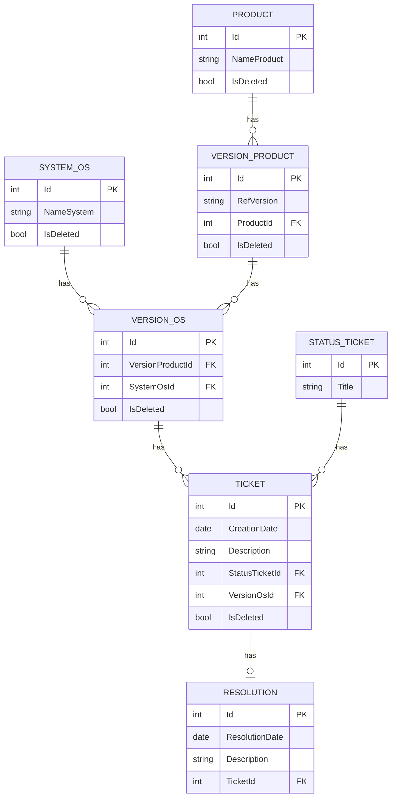

## NexaWorks

Projet de conception et de mise en place d'une base de données de traçabilité pour NexaWorks, permettant de suivre les tickets remontés sur ses différents produits, versions et systèmes d'exploitation.

## Modèle entité-association

## Installation
Cloner le dépôt
Ouvrir la solution dans Visual Studio
Dans la Console du Gestionnaire de package, appliquer les migrations :
Update-Database

La base NexaWorksDb est créée et automatiquement peuplée avec un jeu de données de test (25 tickets répartis sur les 4 produits).

## Documentation des requêtes

Le détail des 20 requêtes demandées (paramètres, résultats attendus et obtenus) ainsi que leurs équivalents en procédures stockées SQL sont fournis dans un document de documentation séparé, transmis en complément de ce dépôt.
